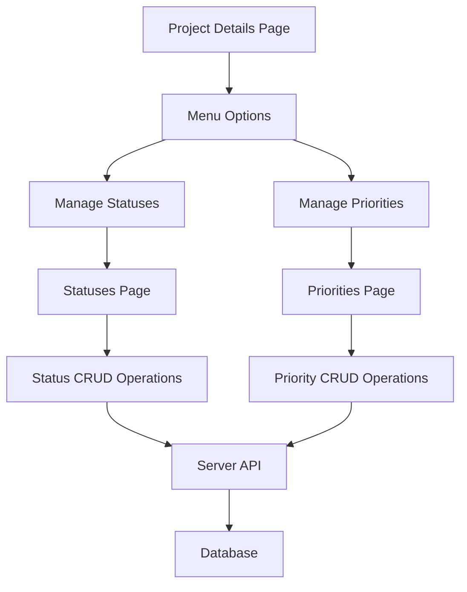

# Implementation Plan: Manage Status and Priority Labels

## Overview
Implement two new features for the project details menu:
1. **Manage Status** - Allow project owners to manage status labels for a specific project
2. **Manage Priority Labels** - Allow project owners to manage priority labels for a specific project

## Requirements Summary
- **Authorization**: Only the project owner can manage statuses and priorities
- **UI Pattern**: Separate pages (similar to members page) at `/projects/[id]/statuses` and `/projects/[id]/priorities`
- **Operations**: Create new, Edit (name, color, order), Delete
- **Defaults**: Include default statuses (To Do, In Progress, Done) and priorities (Low, Medium, High) when a project is created

## Architecture Overview



## Detailed Implementation Steps

### 1. Server-Side Changes

#### 1.1 Update Authorization Logic
**Files to modify:**
- `server/src/services/status.service.js`
- `server/src/services/priority.service.js`

**Changes:**
- Modify authorization checks to only allow project owners (not members) to manage statuses/priorities
- Update the condition from:
  ```javascript
  if (project.ownerId !== userId && !project.members.some(member => member.userId === userId))
  ```
  to:
  ```javascript
  if (project.ownerId !== userId)
  ```

**Affected methods:**
- `statusService.create()`
- `statusService.update()`
- `statusService.delete()`
- `priorityService.create()`
- `priorityService.update()`
- `priorityService.delete()`

#### 1.2 Add Default Statuses and Priorities on Project Creation
**Files to modify:**
- `server/src/services/project.service.js` (or wherever project creation logic exists)

**Changes:**
- After creating a new project, automatically create default statuses:
  - To Do (color: #6B7280, order: 0)
  - In Progress (color: #3B82F6, order: 1)
  - Done (color: #10B981, order: 2)

- After creating a new project, automatically create default priorities:
  - Low (color: #10B981, order: 0)
  - Medium (color: #F59E0B, order: 1)
  - High (color: #EF4444, order: 2)

### 2. Client-Side Changes

#### 2.1 Create Statuses Management Page
**New file:** `client/src/app/projects/[id]/statuses.tsx`

**Features:**
- Display list of all statuses for the project
- Show status name, color indicator, and order
- Add button to create new status (opens modal)
- Edit button for each status (opens modal)
- Delete button for each status (with confirmation)
- Only visible to project owner
- Show loading states
- Handle errors gracefully

**UI Components:**
- Header with back button and "Manage Statuses" title
- Add button (only for owner)
- List of status cards showing:
  - Color indicator (colored circle)
  - Status name
  - Order number
  - Edit and Delete buttons
- Empty state when no statuses exist
- Create/Edit Status Modal with:
  - Name input
  - Color picker (preset colors or custom hex)
  - Order input (number)

#### 2.2 Create Priorities Management Page
**New file:** `client/src/app/projects/[id]/priorities.tsx`

**Features:**
- Display list of all priorities for the project
- Show priority name, color indicator, and order
- Add button to create new priority (opens modal)
- Edit button for each priority (opens modal)
- Delete button for each priority (with confirmation)
- Only visible to project owner
- Show loading states
- Handle errors gracefully

**UI Components:**
- Header with back button and "Manage Priorities" title
- Add button (only for owner)
- List of priority cards showing:
  - Color indicator (colored circle)
  - Priority name
  - Order number
  - Edit and Delete buttons
- Empty state when no priorities exist
- Create/Edit Priority Modal with:
  - Name input
  - Color picker (preset colors or custom hex)
  - Order input (number)

#### 2.3 Create Status/Priority Modal Component
**New file:** `client/src/components/UI/StatusPriorityModal.tsx`

**Features:**
- Reusable modal for creating/editing statuses and priorities
- Form with:
  - Name input (required)
  - Color picker (preset colors + custom hex input)
  - Order input (number, required)
- Validation for required fields
- Loading state during save
- Error handling

**Props:**
- `visible`: boolean
- `onClose`: () => void
- `onSave`: (data: { name: string, color?: string, order: number }) => Promise<void>
- `initialData?: { name: string, color?: string, order: number }` (for edit mode)
- `title`: string (e.g., "Create Status" or "Edit Status")
- `loading`: boolean

#### 2.4 Update Project Details Page Menu
**File to modify:** `client/src/app/projects/[id].tsx`

**Changes:**
- Add "Manage Statuses" menu item (only visible to owner)
- Add "Manage Priorities" menu item (only visible to owner)
- Navigate to respective pages when clicked

**Menu structure:**
```
┌─────────────────────────────┐
│  Add Members                │
├─────────────────────────────┤
│  Manage Statuses (owner)    │
│  Manage Priorities (owner)  │
├─────────────────────────────┤
│  Invite via Email           │
├─────────────────────────────┤
│  Delete Project             │
└─────────────────────────────┘
```

### 3. Data Flow

#### Creating a New Status/Priority
1. User clicks "Add" button on statuses/priorities page
2. Modal opens with empty form
3. User fills in name, selects color, enters order
4. User clicks "Save"
5. Client validates input
6. Client calls API: `POST /projects/{projectId}/statuses` or `POST /projects/{projectId}/priorities`
7. Server validates user is owner
8. Server creates status/priority in database
9. Server returns created status/priority
10. Client updates list and closes modal

#### Editing a Status/Priority
1. User clicks "Edit" button on a status/priority card
2. Modal opens with existing data pre-filled
3. User modifies fields
4. User clicks "Save"
5. Client validates input
6. Client calls API: `PUT /projects/{projectId}/statuses/{id}` or `PUT /projects/{projectId}/priorities/{id}`
7. Server validates user is owner
8. Server updates status/priority in database
9. Server returns updated status/priority
10. Client updates list and closes modal

#### Deleting a Status/Priority
1. User clicks "Delete" button on a status/priority card
2. Confirmation alert appears
3. User confirms deletion
4. Client calls API: `DELETE /projects/{projectId}/statuses/{id}` or `DELETE /projects/{projectId}/priorities/{id}`
5. Server validates user is owner
6. Server checks if status/priority is being used by any tasks
7. If in use, returns error; otherwise, deletes from database
8. Client updates list

### 4. Color Picker Design

**Preset Colors:**
- Gray: #6B7280
- Red: #EF4444
- Orange: #F97316
- Amber: #F59E0B
- Yellow: #EAB308
- Lime: #84CC16
- Green: #10B981
- Emerald: #10B981
- Teal: #14B8A6
- Cyan: #06B6D4
- Sky: #0EA5E9
- Blue: #3B82F6
- Indigo: #6366F1
- Violet: #8B5CF6
- Purple: #A855F7
- Fuchsia: #D946EF
- Pink: #EC4899
- Rose: #F43F5E

**UI:**
- Grid of color circles
- Selected color has a checkmark or border
- Option to enter custom hex color

### 5. Error Handling

**Client-side:**
- Show error alerts for API failures
- Display validation errors inline
- Show loading indicators during async operations
- Handle network errors gracefully

**Server-side:**
- Return appropriate HTTP status codes:
  - 400: Bad Request (validation errors, duplicate names)
  - 403: Forbidden (not owner)
  - 404: Not Found (project/status/priority not found)
  - 500: Internal Server Error
- Provide descriptive error messages

### 6. Edge Cases to Handle

1. **Deleting in-use status/priority**: Show error message explaining it's being used by tasks
2. **Duplicate names**: Prevent creating status/priority with same name in same project
3. **Empty list**: Show empty state with helpful message
4. **Non-owner access**: Hide menu items and show access denied message if accessed directly
5. **Network errors**: Retry mechanism or user-friendly error messages
6. **Invalid color format**: Validate hex color format

### 7. File Structure

```
client/src/
├── app/
│   └── projects/
│       └── [id]/
│           ├── statuses.tsx          (NEW)
│           └── priorities.tsx        (NEW)
├── components/
│   └── UI/
│       └── StatusPriorityModal.tsx   (NEW)
└── services/
    ├── statusService.ts              (EXISTS - no changes needed)
    └── priorityService.ts            (EXISTS - no changes needed)

server/src/
├── services/
│   ├── status.service.js             (MODIFY - update authorization)
│   ├── priority.service.js           (MODIFY - update authorization)
│   └── project.service.js            (MODIFY - add defaults on create)
└── controllers/
    ├── status.controller.js          (NO CHANGES)
    └── priority.controller.js        (NO CHANGES)
```

## Testing Checklist

- [ ] Only project owner can see "Manage Statuses" and "Manage Priorities" menu items
- [ ] Non-owners cannot access status/priority management pages (access denied)
- [ ] Default statuses and priorities are created when a new project is created
- [ ] Can create new status with valid data
- [ ] Can create new priority with valid data
- [ ] Can edit existing status
- [ ] Can edit existing priority
- [ ] Can delete status not in use
- [ ] Can delete priority not in use
- [ ] Cannot delete status in use by tasks (shows error)
- [ ] Cannot delete priority in use by tasks (shows error)
- [ ] Cannot create duplicate status name in same project
- [ ] Cannot create duplicate priority name in same project
- [ ] Color picker works correctly
- [ ] Order field works correctly
- [ ] Loading states display correctly
- [ ] Error messages display correctly
- [ ] Empty states display correctly
